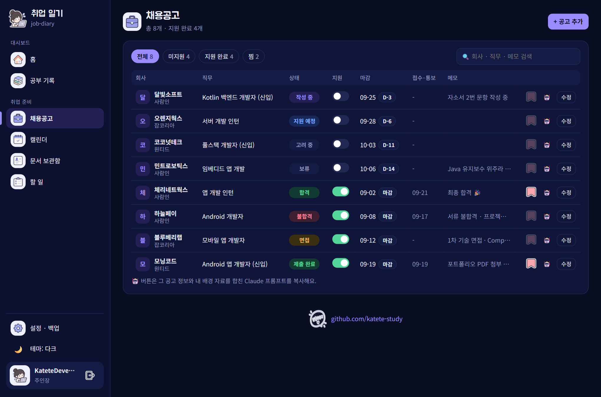
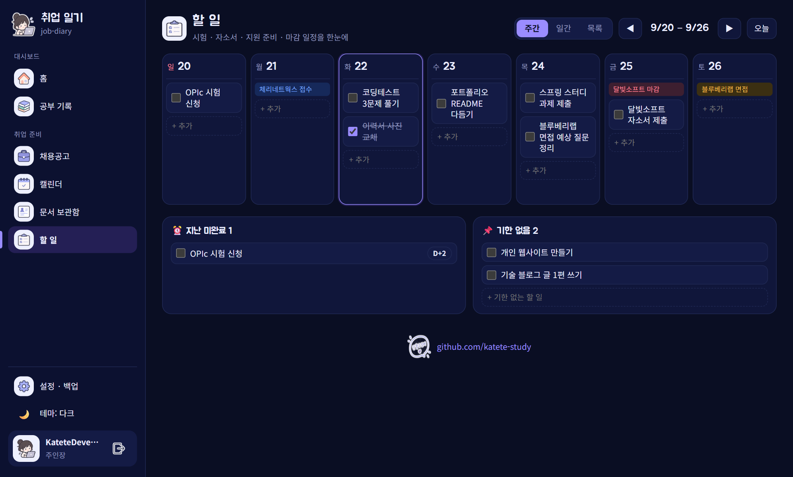
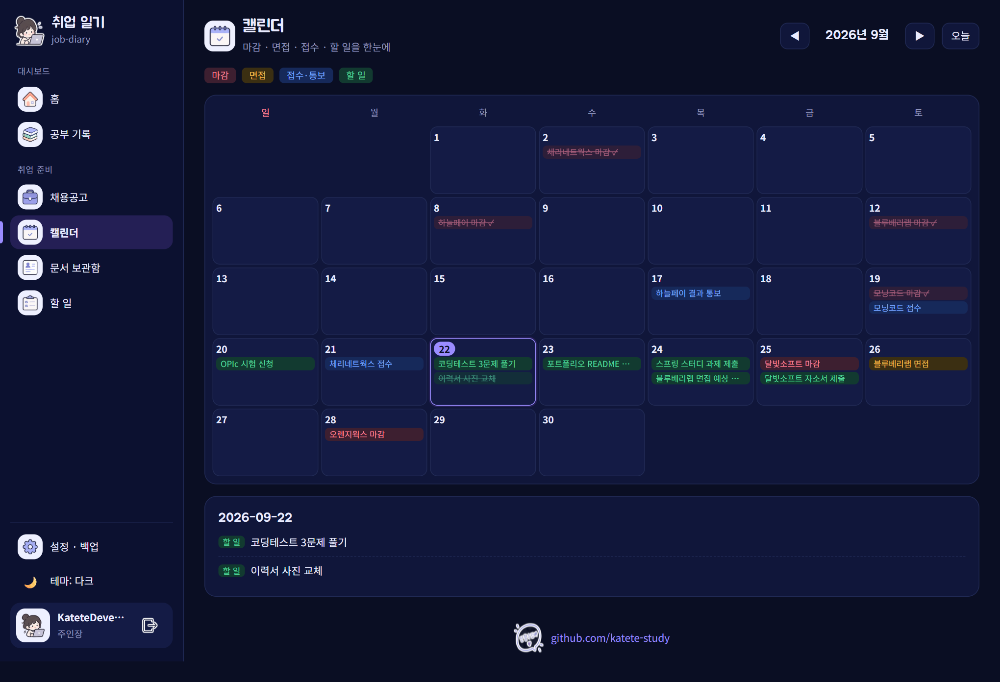
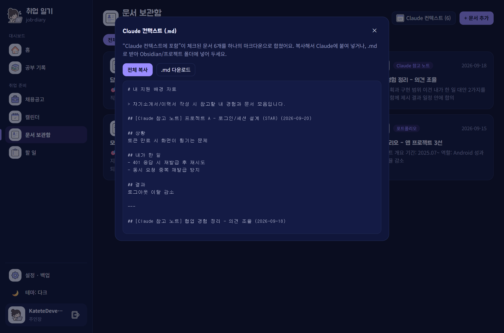
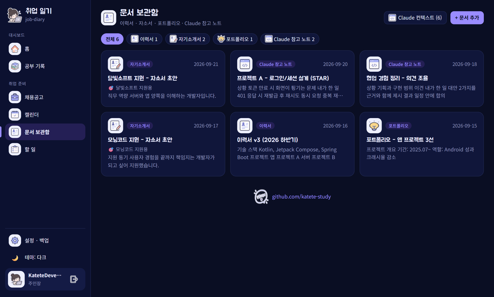
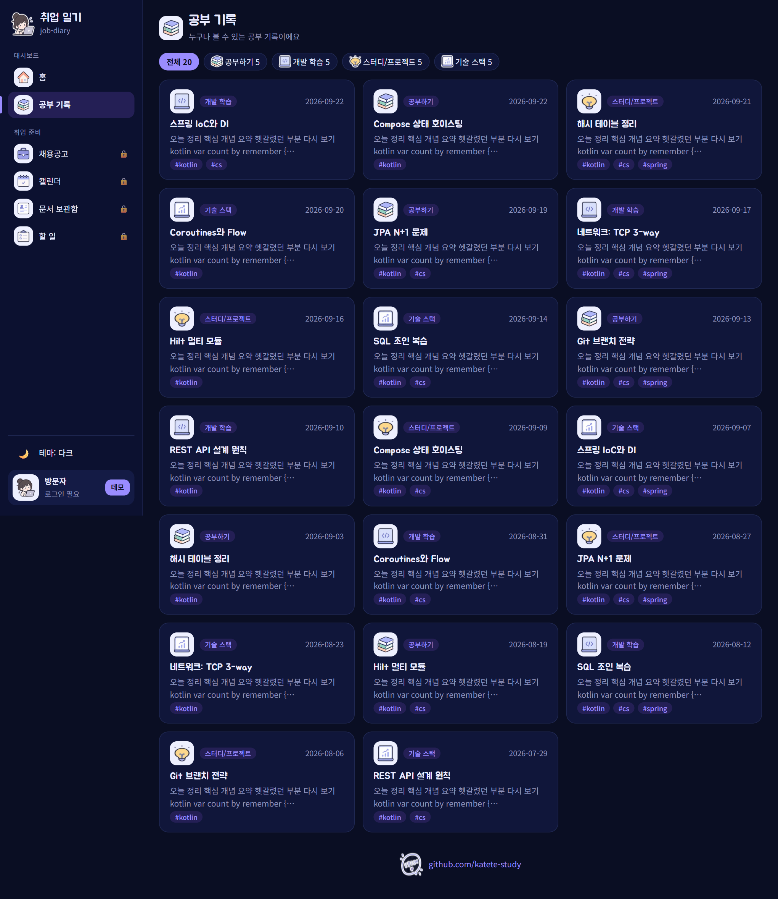
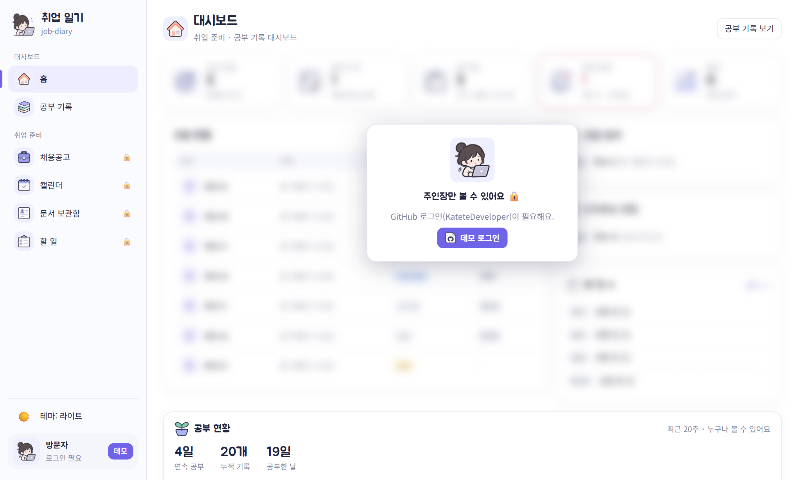
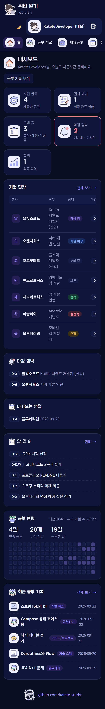
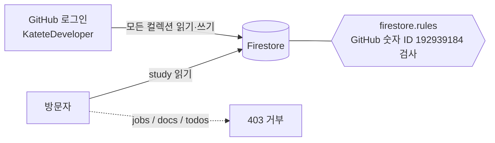

<div align="center">


# 백수의 취업 일기 · job-diary

**공고 · 일정 · 문서 · 할 일을 한곳에 모으는 나만의 취업 준비 대시보드**
공부 기록은 누구나 볼 수 있고, 취업 데이터는 GitHub 로그인한 **나만** 열어 볼 수 있어요.

[](https://github.com/katete-study/job-diary/actions/workflows/deploy.yml)


-FFCA28?logo=firebase&logoColor=black)

**🔗 [job-diary-28094.web.app](https://job-diary-28094.web.app)**


</div>

> 📌 이 문서의 스크린샷은 **가짜(허구) 데이터**로 찍었어요. 실제 공고·자소서는 저장소에 없고, 로그인한 본인의 Firestore에만 저장돼요.

---

## 목차

- [주요 기능](#주요-기능)
- [스크린샷](#스크린샷)
- [접근 제어](#접근-제어)
- [기술 스택](#기술-스택)
- [프로젝트 구조](#프로젝트-구조)
- [로컬 실행](#로컬-실행)
- [배포 설정](#배포-설정-한-번만)
- [내 데이터 다루기](#내-데이터-다루기)
- [Claude로 자소서 쓰기](#claude로-자소서-쓰기)
- [비용](#비용)
- [로드맵](#로드맵)

---

## 주요 기능

| 영역 | 기능 |
| --- | --- |
| 🏠 **대시보드** | 지원 완료 · 결과 대기 · 준비 중 · 마감 임박 · 합격 통계, 지원 현황 표, 다가오는 면접, 남은 할 일 |
| 💼 **채용공고** | 사람인 · 잡코리아 · 원티드 URL 자동 인식, 상태 9단계(고려 중 → 지원 예정 → 작성 중 → 제출 완료 → 면접 → 합격/불합격, 보류, 전환됨), **지원 on/off 스위치**, 마감 D-day, 찜, 검색·필터 |
| 📅 **캘린더** | 공고 마감 · 면접 · 접수/결과 통보 · 할 일을 월간 달력 하나에 |
| ✅ **할 일** | **주간 / 일간 / 목록** 보기(일요일 시작), 공고 일정 함께 표시, 칸별 빠른 추가(Enter), **드래그로 날짜 이동**, 지난 미완료 · 기한 없음 따로 모아보기 |
| 📄 **문서 보관함** | 이력서 · 자기소개서 · 포트폴리오 · Claude 참고 노트를 마크다운으로 저장, 공고와 연결 |
| 🤖 **Claude 연동** | 문서를 하나의 `.md`로 합쳐 복사/다운로드, 공고별 **자소서 요청 프롬프트** 한 번에 복사 |
| 📚 **공부 기록** (공개) | 공부하기 · 개발 학습 · 스터디/프로젝트 · 기술 스택 글, 연속 공부 일수와 히트맵 |
| 🔒 **블러 처리** | 다른 사람이 보면 취업 영역이 **가짜 샘플 데이터로 블러** 처리돼요 |
| 💾 **백업/복원** | 전체 데이터를 JSON 한 파일로 내려받기·불러오기, 오류 발생 시 화면에 원인 표시 |
| 🎨 **디자인** | 대시보드 레이아웃 + 귀여운 캐릭터 아이콘, 라이트/다크/시스템 테마, 모바일 대응 |

---

## 스크린샷

<table>
  <tr>
    <td width="50%">
      <b>💼 채용공고</b><br/>
      <sub>상태 · 지원 스위치 · 마감 D-day · 찜 · Claude 프롬프트</sub><br/>
      
    </td>
    <td width="50%">
      <b>✅ 할 일 — 주간 보드</b><br/>
      <sub>공고 마감·면접이 함께 보이고, 끌어서 날짜를 옮겨요</sub><br/>
      
    </td>
  </tr>
  <tr>
    <td>
      <b>📅 캘린더</b><br/>
      <sub>마감 · 면접 · 접수/통보 · 할 일</sub><br/>
      
    </td>
    <td>
      <b>🤖 Claude 컨텍스트</b><br/>
      <sub>문서를 하나의 .md로 합쳐 복사/다운로드</sub><br/>
      
    </td>
  </tr>
  <tr>
    <td>
      <b>📄 문서 보관함</b><br/>
      <sub>이력서 · 자소서 · 포트폴리오 · 참고 노트</sub><br/>
      
    </td>
    <td>
      <b>📚 공부 기록 (누구나 열람)</b><br/>
      <sub>로그인 없이도 볼 수 있는 공개 영역</sub><br/>
      
    </td>
  </tr>
  <tr>
    <td>
      <b>🔒 방문자가 보면</b><br/>
      <sub>취업 영역은 가짜 데이터로 블러 처리</sub><br/>
      
    </td>
    <td align="center">
      <b>📱 모바일</b><br/>
      <sub>사이드바가 상단 메뉴로 바뀌어요</sub><br/>
      
    </td>
  </tr>
</table>

---

## 접근 제어

프런트에서 화면만 가리면 개발자 도구로 뚫릴 수 있어요. 그래서 **서버(Firestore 보안 규칙)** 가 직접 막아요.



| 컬렉션 | 읽기 | 쓰기 |
| --- | --- | --- |
| `study` (공부 기록) | 누구나 | 소유자 |
| `jobs` (공고) | 소유자 | 소유자 |
| `docs` (이력서 · 자소서 · 포트폴리오 · 참고 노트) | 소유자 | 소유자 |
| `todos` (할 일) | 소유자 | 소유자 |

- 소유자 판정은 **GitHub 숫자 ID**(로그인 이름은 바꿀 수 있어서 ID로 검사)로 해요. → [`firestore.rules`](firestore.rules)
- 방문자 화면의 블러 아래 내용은 [`src/lib/sample.ts`](src/lib/sample.ts)의 **가짜 샘플**이에요. 진짜 데이터는 서버가 아예 내려주지 않아요.
- 검증: 비로그인 상태에서 `jobs`/`docs`/`todos` 읽기·쓰기는 모두 `403`, `study` 읽기만 `200`.

---

## 기술 스택

| 구분 | 사용 |
| --- | --- |
| 프런트 | Vite · React 18 · TypeScript · React Router |
| 렌더링 | react-markdown · remark-gfm |
| 인증 | Firebase Authentication (GitHub 로그인) |
| 데이터 | Cloud Firestore (실시간 구독) |
| 배포 | GitHub Actions → Firebase Hosting + Firestore 규칙 |
| 스타일 | 순수 CSS 변수 기반 라이트/다크 테마 |

---

## 프로젝트 구조

```text
job-diary/
├─ src/
│  ├─ components/     # Layout(사이드바), ui(Locked·StatCard·Pill 등)
│  ├─ lib/            # firebase, auth, store(구독/저장), sample(블러용), util
│  ├─ pages/          # Home · Jobs · Calendar · Todos · Docs · Study · Settings
│  └─ styles.css
├─ public/icons/      # 캐릭터 아이콘(PNG)
├─ docs/screenshots/  # README 스크린샷 (가짜 데이터)
├─ scripts/           # 개인 데이터 → 가져오기용 JSON 변환 스크립트
├─ seed/private/      # ⚠️ 개인 데이터 (gitignore, 커밋 금지)
├─ firestore.rules    # 서버 접근 제어
├─ firebase.json      # Hosting/캐시/규칙 설정
└─ .github/workflows/deploy.yml
```

---

## 로컬 실행

```bash
npm install
npm run dev
```

- `.env`가 **없으면 로컬 데모 모드**(브라우저 localStorage)로 동작해요. 로그인 버튼이 "데모 로그인"이 되고, 설정 → **샘플 데이터 채우기**로 화면을 바로 확인할 수 있어요.
- 실제 Firebase에 붙이려면 `.env.example`을 복사해 값을 채우세요.

```bash
cp .env.example .env
```

---

## 배포 설정 (한 번만)

1. **Firebase 프로젝트 생성** (Spark 무료 플랜) → **Authentication**에서 **GitHub** 로그인 사용 설정
2. **GitHub OAuth App 생성**: GitHub → Settings → Developer settings → OAuth Apps
   - *Authorization callback URL* (= *Redirect URI*) → Firebase 콘솔의 GitHub 제공업체 화면에 나오는 URL
   - 발급된 Client ID / Secret을 Firebase 콘솔에 입력
3. **Firestore Database** 생성(프로덕션 모드), **웹 앱 등록** 후 config 확인
4. Authentication → 설정 → **승인된 도메인**에 배포 도메인 추가 (`<project>.web.app`은 기본 포함)
5. **서비스 계정 키** 발급: 프로젝트 설정 → 서비스 계정 → 새 비공개 키 생성
   - Google Cloud IAM에서 해당 계정에 **Firebase 관리자** + **Service Usage 소비자** 역할 추가
6. GitHub 저장소 설정
   - **Secrets** → `FIREBASE_SERVICE_ACCOUNT` = 키 JSON 전체
   - **Variables** → `VITE_FIREBASE_API_KEY`, `VITE_FIREBASE_AUTH_DOMAIN`, `VITE_FIREBASE_PROJECT_ID`, `VITE_FIREBASE_APP_ID`, `VITE_OWNER_GITHUB_ID`
7. `main`에 push → 빌드 후 **Hosting과 Firestore 규칙**이 함께 배포돼요.

> 🔑 Firebase 웹 config 값은 비밀이 아니에요(공개돼도 보안 규칙이 보호). 진짜 비밀은 **서비스 계정 키**뿐이라 Secret으로만 두세요. 발급한 JSON 파일은 등록 후 삭제하세요.

<details>
<summary>배포 중 자주 만나는 문제</summary>

| 증상 | 원인 / 해결 |
| --- | --- |
| `403 Permission denied to get service` | 서비스 계정에 *Service Usage 소비자* 역할이 없어요. 추가 후 1~2분 뒤 재실행 |
| `firebaserules ... 403` | IAM 반영 지연일 수 있어요. 잠시 후 재실행하거나 *Firebase 관리자* 역할 확인 |
| 배포했는데 옛 화면이 보여요 | 브라우저 캐시. `Ctrl+Shift+R`. (`firebase.json`에서 `no-cache`로 이미 대응) |
| GitHub 로그인 팝업이 실패해요 | 승인된 도메인과 OAuth App의 Redirect URI를 확인 |

</details>

---

## 내 데이터 다루기

개인 데이터(공고 · 자소서)는 **public 저장소에 올리지 않아요.**

1. `seed/private/` 아래에 원본을 두고 (이 폴더는 `.gitignore`)
2. 변환 스크립트로 가져오기용 JSON을 만들어요.

   ```bash
   node scripts/build-seed.mjs            # → seed/private/seed.json
   node scripts/build-notion-update.mjs   # → seed/private/notion-update.json
   ```

3. 배포된 사이트에 **GitHub 로그인** → **설정 · 백업 → 백업 불러오기**로 파일을 선택하면 Firestore에 저장돼요.
   - 저장 결과가 `✅ 저장 완료: jobs 11 · docs 19 · …`처럼 화면에 나와요.
   - 같은 ID는 **덮어써요.** 앱에서 고친 값이 있으면 다시 가져오지 마세요.
4. 정기 백업은 같은 화면의 **백업 내려받기**(JSON)로 해요.

---

## Claude로 자소서 쓰기

1. **문서 보관함**에 프로젝트 경험을 *상황 → 행동 → 결과* 형식의 **Claude 참고 노트**로 쌓아요. (이력서·포트폴리오도 함께)
2. **Claude 컨텍스트** 버튼 → 포함 체크된 문서가 하나의 `.md`로 합쳐져요. 복사하거나 내려받아 Claude · Obsidian · 프로젝트 폴더에 넣을 수 있어요.
3. **채용공고 표의 🤖 버튼** → *그 공고 정보 + 내 배경 자료 + 요청문*이 한 번에 복사돼요. Claude에 붙여 넣으면 공고에 맞는 자소서 초안을 받을 수 있어요.

> 요청문에는 "자료에 없는 내용은 지어내지 말아줘"가 들어 있어요.

---

## 비용

**전부 무료 범위에서 동작해요.**

| 서비스 | 요금 | 비고 |
| --- | --- | --- |
| Firebase | **Spark(무료)** | 카드 미연결 → 한도를 넘으면 청구 대신 기능이 멈춰요 |
| GitHub Actions | **무료** | public 저장소는 Actions 사용 시간이 무료 |
| GitHub | 결제 수단 없음 | 과금 자체가 불가능한 구조 |

Spark 대략 한도: Firestore 저장 1GiB · 읽기 하루 5만 · 쓰기 하루 2만 / Hosting 저장 10GB · 전송 하루 약 360MB

⚠️ Firebase를 **Blaze로 올리거나**, 저장소를 **private으로 바꿔 무료 Actions 한도를 넘기면** 비용이 생길 수 있어요.

---

## 로드맵

- [ ] 사람인/잡코리아 URL에서 **회사명·직무 자동 채우기** — 브라우저(CORS)로는 불가능해서 Cloud Functions(Blaze, 카드 필요) 또는 GitHub Action 스크래퍼가 필요해요
- [ ] 마감 임박 **알림**(이메일/푸시)
- [ ] 공고별 **면접 준비 체크리스트**
- [ ] 캘린더에서 바로 일정 추가

---

<div align="center">
<sub>🥕 오늘도 한 걸음씩 · <a href="https://github.com/katete-study">github.com/katete-study</a></sub>
</div>
